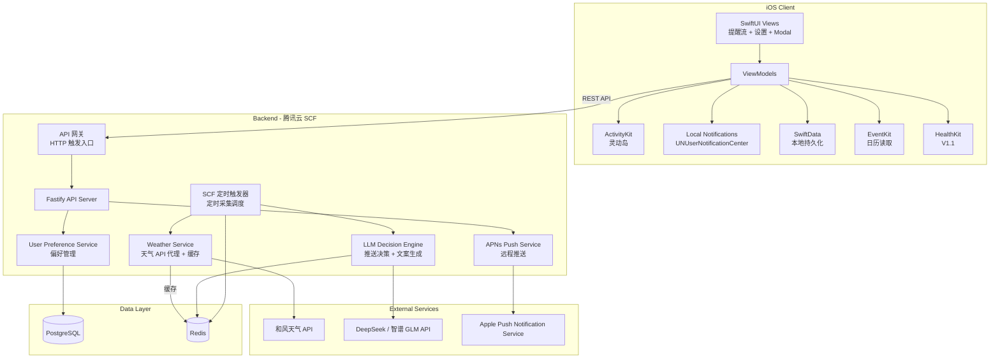
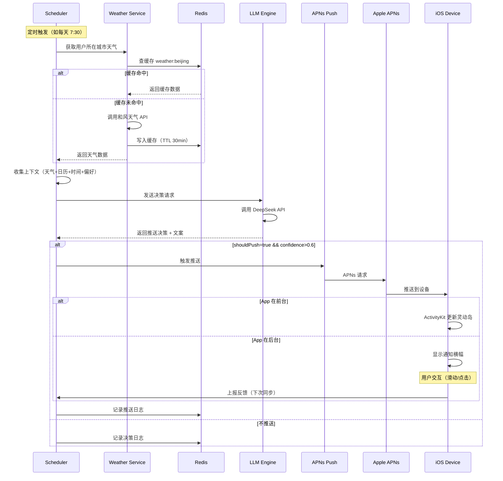

# 智能提醒 App 技术架构设计文档

| 项目 | 内容 |
|------|------|
| 版本 | v1.1 |
| 日期 | 2026-05-06 |
| 作者 | 架构设计 |
| 团队规模 | 1-2 人 |
| 目标市场 | 中国区 iOS |

---

## 1. 技术栈选型

### 1.1 iOS 客户端

| 层 | 选型 | 理由 |
|----|------|------|
| 语言 | Swift 5.9+ | Apple 生态首选，与 SwiftUI/ActivityKit 深度集成 |
| UI 框架 | SwiftUI | 极简 UI（2 页 + 1 Modal），声明式开发效率高 |
| 架构模式 | MVVM + Clean Architecture（简化版） | 2 页面不需要完整 Clean Architecture，但 ViewModel 层保留清晰的数据流 |
| 网络请求 | URLSession + async/await | 原生支持，无需引入 Alamofire 等第三方库 |
| 依赖管理 | Swift Package Manager（SPM） | Apple 官方方案，Xcode 原生集成 |
| 本地存储 | SwiftData | iOS 17+ 原生 ORM，替代 Core Data，API 更简洁 |
| 本地通知 | UserNotifications + ActivityKit | Live Activity / 灵动岛必选 |
| 日历 | EventKit | 系统框架，无需第三方 |

### 1.2 后端（Node.js vs Python 论证）

**最终选型：Node.js (Fastify)**

| 维度 | Node.js (Fastify) | Python (FastAPI) |
|------|--------------------|-------------------|
| **推送性能** | ✅ 单线程事件循环天然适合大量 I/O（APNs 长连接、定时器） | ⚠️ asyncio 可行，但生态工具链不如 Node 成熟 |
| **LLM 集成** | ✅ OpenAI SDK 官方支持 Node.js；流式输出体验一致 | ✅ 同样支持，Python 生态更丰富但本项目用不到 |
| **定时任务** | ✅ SCF 定时触发器（Serverless 原生）/ node-cron（容器化备选）成熟方案 | ⚠️ APScheduler / Celery 可行，但架构更重 |
| **部署成本** | ✅ 单进程内存占用低（~100MB），适合 1-2 人运维 | ⚠️ Python 进程内存略高，Gunicorn/Uvicorn 配置稍复杂 |
| **团队技能** | — 看团队背景决定 | — |
| **开发速度** | ✅ 前后端语言统一（JS/TS），减少上下文切换 | — |

**结论：** 本项目核心是「定时采集 → LLM 决策 → 推送」，是典型的 I/O 密集型场景。Node.js 的事件循环模型天然匹配，且 1-2 人团队用同一种语言栈（TypeScript 全栈）效率最高。Python 在 LLM 生态有优势，但本项目对 LLM 的调用仅限文案生成和推送决策，复杂度可控。

### 1.3 数据库

| 数据 | 选型 | 理由 |
|------|------|------|
| 用户 / 偏好 | PostgreSQL | 关系型数据，JSONB 存储灵活偏好配置，成熟稳定 |
| 缓存 | Redis | 天气缓存（TTL 30min）、推送队列、限流计数 |
| LLM 缓存 | Redis（可选） | 相似上下文命中缓存，降低 API 调用成本 |

### 1.4 基础设施

| 组件 | 选型 | 理由 |
|------|------|------|
| 云服务商 | 腾讯云 | 国内部署，SCF Serverless 按需付费 |
| 计算层 | 腾讯云函数 SCF（Serverless） | 按需付费，V1 免费额度足够，推送调度用定时触发器 |
| 数据库 | 腾讯云 PostgreSQL | 托管数据库，免运维 |
| 缓存 | 腾讯云 Redis | 托管缓存，V1 选最小规格 |
| CI/CD | GitHub Actions | 与代码仓库集成，配置简单 |
| 监控 | 腾讯云 CLS（日志）+ 云监控 | 免费额度足够 |
| 日志 | 腾讯云 CLS | 统一日志服务 |

---

## 2. 系统架构总览

### 2.1 架构图



### 2.2 各模块职责

| 模块 | 职责 |
|------|------|
| **SwiftUI Views** | 提醒流列表、设置页、提醒详情 Modal，纯视图层 |
| **ViewModels** | 业务逻辑编排，数据绑定，调用 Service 层 |
| **ActivityKit** | 管理灵动岛 Live Activity 生命周期，展示当前活跃提醒 |
| **Local Notifications** | 本地通知调度，无网络时的主要推送通道 |
| **SwiftData** | 提醒记录、用户偏好本地副本、反馈数据的本地持久化 |
| **EventKit** | 读取系统日历事件，作为上下文数据源 |
| **HealthKit** | V1.1 引入，读取步数、睡眠等数据，仅存本地 |
| **API 网关** | 腾讯云 API 网关，HTTP 请求转发到 SCF 函数 |
| **SCF 定时触发器** | 定时触发数据采集（天气）和 LLM 决策（按用户活跃时段） |
| **Fastify API** | REST API 处理，用户认证、设备管理、偏好同步（HTTP 触发函数内运行） |
| **Weather Service** | 调用天气 API 并做 Redis 缓存，统一错误处理 |
| **LLM Decision Engine** | 根据上下文生成推送决策（是否推送 + 文案） |
| **APNs Push Service** | 管理 device token，发送远程通知 |
| **Preference Service** | 用户偏好 CRUD，推送时间段、关注类别等 |

---

## 3. iOS 客户端架构

### 3.1 目录结构

```
RemindApp/
├── App/
│   ├── RemindApp.swift              # @main 入口
│   └── AppDelegate.swift            # UNUserNotificationCenter delegate
│
├── Features/
│   ├── ReminderFeed/                # 提醒流页面
│   │   ├── ReminderFeedView.swift
│   │   ├── ReminderFeedViewModel.swift
│   │   └── ReminderCardView.swift
│   │
│   ├── Settings/                    # 设置页面
│   │   ├── SettingsView.swift
│   │   └── SettingsViewModel.swift
│   │
│   └── ReminderDetail/              # 提醒详情 Modal
│       ├── ReminderDetailView.swift
│       └── ReminderDetailViewModel.swift
│
├── Services/
│   ├── WeatherService.swift         # 天气数据获取
│   ├── CalendarService.swift        # EventKit 封装
│   ├── NotificationService.swift    # 本地通知 + ActivityKit 管理
│   ├── APNSService.swift            # device token 管理
│   ├── FeedbackService.swift        # 反馈收集（隐性 + 显性）
│   └── BackendSyncService.swift     # 与后端同步
│
├── Models/
│   ├── Reminder.swift               # SwiftData @Model
│   ├── UserPreference.swift         # SwiftData @Model
│   ├── WeatherInfo.swift
│   └── CalendarEvent.swift
│
├── LiveActivity/
│   ├── RemindLiveActivity.swift     # ActivityKit widget
│   └── RemindLiveActivityAttributes.swift
│
├── Extensions/
│   ├── Date+Helpers.swift
│   └── Color+Theme.swift
│
└── Resources/
    ├── Assets.xcassets
    └── Localizable.xcstrings        # 中文本地化
```

### 3.2 ActivityKit 集成

```swift
// Live Activity 属性定义
struct RemindAttributes: ActivityAttributes {
    struct ContentState: Codable, Sendable {
        var reminderText: String
        var category: ReminderCategory  // .weather / .calendar / .time / .health
        var timestamp: Date
    }
    var reminderId: String
    var category: ReminderCategory
}

// 启动 Live Activity
func startLiveActivity(reminder: Reminder) async {
    let attributes = RemindAttributes(
        reminderId: reminder.id,
        category: reminder.category
    )
    let state = RemindAttributes.ContentState(
        reminderText: reminder.text,
        category: reminder.category,
        timestamp: Date()
    )
    
    do {
        let activity = try Activity.request(
            attributes: attributes,
            content: .init(state: state, staleDate: nil)
        )
        currentActivity = activity
    } catch {
        // 降级：使用普通通知
        NotificationService.shared.scheduleLocalNotification(reminder: reminder)
    }
}

// 更新 Live Activity（用于刷新文案或状态）
func updateLiveActivity(activity: Activity<RemindAttributes>, newText: String) async {
    let state = RemindAttributes.ContentState(
        reminderText: newText,
        category: activity.attributes.category,
        timestamp: Date()
    )
    await activity.update(.init(state: state, staleDate: nil))
}

// 结束 Live Activity
func endLiveActivity(activity: Activity<RemindAttributes>) async {
    await activity.end(nil, dismissalPolicy: .after(.now + 300))
}
```

**关键设计：**
- 灵动岛同时只展示**最近一条活跃提醒**（`maxActive = 1`）
- Live Activity 最长存活 8 小时（系统限制），超时自动降级为普通通知
- 支持通过 APNs 的 `content-state` 更新远程 Live Activity

### 3.3 本地通知调度

```swift
class NotificationService: ObservableObject {
    private let center = UNUserNotificationCenter.current()
    
    /// 调度基于时间的提醒
    func scheduleTimeBasedReminder(
        text: String,
        triggerDate: Date,
        category: ReminderCategory
    ) {
        let content = UNMutableNotificationContent()
        content.title = category.displayTitle
        content.body = text
        content.sound = .default
        content.categoryIdentifier = "REMINDER_ACTION"
        content.userInfo = ["category": category.rawValue]
        
        let trigger = UNTimeIntervalNotificationTrigger(
            timeInterval: max(triggerDate.timeIntervalSinceNow, 1),
            repeats: false
        )
        
        let request = UNNotificationRequest(
            identifier: UUID().uuidString,
            content: content,
            trigger: trigger
        )
        center.add(request)
    }
    
    /// 处理通知动作（滑动反馈等微交互）
    func handleAction(response: UNNotificationResponse) {
        switch response.actionIdentifier {
        case "DISMISS_ACTION":
            FeedbackService.shared.recordImplicitDismiss()
        case "HELPFUL_ACTION":
            FeedbackService.shared.recordExplicitFeedback(.helpful)
        case "NOT_HELPFUL_ACTION":
            FeedbackService.shared.recordExplicitFeedback(.notHelpful)
        default:
            FeedbackService.shared.recordImplicitDismiss()
        }
    }
}
```

### 3.4 数据持久化（SwiftData）

```swift
@Model
final class Reminder {
    @Attribute(.unique) var id: UUID
    var text: String
    var category: ReminderCategory    // weather, calendar, time, health
    var source: ReminderSource        // local, remote, llm_generated
    var createdAt: Date
    var isRead: Bool
    var isDismissed: Bool
    var feedback: FeedbackType?       // nil=未反馈, helpful, notHelpful
    var liveActivityId: String?
    
    @Relationship(deleteRule: .cascade) var weatherContext: WeatherContext?
    @Relationship(deleteRule: .cascade) var calendarContext: CalendarContext?
}

@Model
final class UserPreference {
    @Attribute(.unique) var id: UUID
    var quietHoursStart: Date?        // 免打扰开始时间
    var quietHoursEnd: Date?          // 免打扰结束时间
    var enabledCategories: Set<ReminderCategory>  // 启用的提醒类别
    var pushFrequency: PushFrequency  // low, normal, high
    var lastSyncedAt: Date
}
```

---

## 4. 后端服务架构

### 4.1 服务总览

```
backend/
├── src/
│   ├── functions/                   # 腾讯云函数
│   │   ├── weather-refresh/         # 天气数据刷新（定时触发）
│   │   ├── push-decision/           # LLM 推送决策（定时触发）
│   │   ├── apns-push/               # APNs 推送执行
│   │   ├── feedback-report/         # 反馈上报（HTTP 触发）
│   │   ├── preferences-api/         # 偏好管理（HTTP 触发）
│   │   ├── devices-api/             # 设备管理（HTTP 触发）
│   │   └── auth/                    # 认证（HTTP 触发）
│   ├── shared/                      # 共享层
│   │   ├── db.ts                    # PostgreSQL 连接池
│   │   ├── redis.ts                 # Redis 客户端
│   │   ├── llm.ts                   # LLM API 封装
│   │   ├── apns.ts                  # APNs 推送封装
│   │   └── weather.ts               # 天气 API 封装
│   ├── layers/                      # 腾讯云层（共享依赖打包）
│   └── template.yaml                # SCF 部署模板
└── package.json
```

### 4.1.1 API 网关

SCF 函数本身不直接暴露 HTTP 端口，需要通过**腾讯云 API 网关**将 HTTP 请求转发到函数：

- **HTTP 触发函数**（auth、preferences-api、devices-api、feedback-report）通过 API 网关对外提供 REST API
- API 网关负责：请求路由、鉴权转发、限流、HTTPS 证书管理
- **定时触发函数**（weather-refresh、push-decision）由 SCF 定时触发器直接调用，无需 API 网关
- API 网关免费额度：每月 100 万次调用，V1 足够使用

### 4.2 天气服务

**API 选型：和风天气（QWeather）**

| 维度 | 和风天气 | 心知天气 | 彩云天气 |
|------|----------|----------|----------|
| 免费额度 | 1000 次/天 | 1000 次/天 | 100 次/天 |
| 分钟级降水 | ✅ Pro 版 | ✅ | ✅ |
| 空气质量 | ✅ | ✅ | ❌ |
| 生活指数 | ✅ | ✅ | ✅ |
| 价格（V1 预估） | ~99 元/月（开发者版） | ~120 元/月 | ~199 元/月 |
| **推荐** | ✅ | 备选 | 不推荐 |

```typescript
// weather.service.ts
export class WeatherService {
  private readonly CACHE_TTL = 30 * 60; // 30 分钟缓存

  async getWeather(location: string): Promise<WeatherData> {
    const cacheKey = `weather:${location}`;
    
    // 1. 先查 Redis 缓存
    const cached = await redis.get(cacheKey);
    if (cached) return JSON.parse(cached);
    
    // 2. 调用和风天气 API
    const response = await fetch(
      `https://devapi.qweather.com/v7/weather/now?location=${location}&key=${API_KEY}`
    );
    const data = await response.json();
    
    // 3. 写入缓存
    await redis.set(cacheKey, JSON.stringify(data), 'EX', this.CACHE_TTL);
    
    return data;
  }

  /// 批量获取用户所在城市天气（定时任务调用，避免重复请求）
  async batchRefreshWeather(cities: string[]): Promise<void> {
    // 同一城市的请求合并
    const uniqueCities = [...new Set(cities)];
    await Promise.allSettled(uniqueCities.map(city => this.getWeather(city)));
  }
}
```

### 4.3 LLM 决策引擎

```typescript
// llm-decision.service.ts
interface DecisionContext {
  userId: string;
  weather: WeatherData | null;
  calendarEvents: CalendarEvent[];
  timeOfDay: string;        // "morning" | "afternoon" | "evening" | "night"
  dayOfWeek: string;
  recentFeedback: FeedbackSummary;
  preferences: UserPreference;
}

interface PushDecision {
  shouldPush: boolean;
  category: string;
  text: string;             // LLM 生成的文案
  confidence: number;       // 0-1
  reasoning: string;        // 决策理由（用于日志分析）
}

export class LLMDecisionService {
  async decide(context: DecisionContext): Promise<PushDecision> {
    const prompt = this.buildDecisionPrompt(context);
    
    // 1. 检查相似上下文缓存
    const cacheKey = this.hashContext(context);
    const cached = await redis.get(`decision:${cacheKey}`);
    if (cached) return JSON.parse(cached);
    
    // 2. 调用 LLM（DeepSeek V3 或智谱 GLM-4）
    const response = await callLLM(prompt, {
      model: 'deepseek-chat',
      temperature: 0.7,
      max_tokens: 300,
      response_format: { type: 'json_object' }
    });
    
    const decision: PushDecision = JSON.parse(response);
    
    // 3. 后处理：强制检查免打扰时段
    if (this.isInQuietHours(context.preferences)) {
      decision.shouldPush = false;
    }
    
    // 4. 缓存决策（1 小时）
    await redis.set(`decision:${cacheKey}`, JSON.stringify(decision), 'EX', 3600);
    
    return decision;
  }

  private buildDecisionPrompt(ctx: DecisionContext): string {
    return `你是智能提醒助手。根据以下上下文判断是否应该给用户推送一条生活提醒。

当前时间：${ctx.dayOfWeek} ${ctx.timeOfDay}
天气：${ctx.weather ? JSON.stringify(ctx.weather) : '未知'}
近期日历事件：${ctx.calendarEvents.map(e => e.title).join('、') || '无'}
用户反馈偏好：${JSON.stringify(ctx.recentFeedback)}
推送频率偏好：${ctx.preferences.pushFrequency}

请返回 JSON：
{
  "shouldPush": true/false,
  "category": "weather/calendar/lifestyle/time",
  "text": "提醒文案（简洁自然，< 30字）",
  "confidence": 0.0-1.0,
  "reasoning": "简要决策理由"
}`;
  }
}
```

**LLM 选型：**

| 模型 | 价格 | 延迟 | 推荐度 |
|------|------|------|--------|
| DeepSeek V3 | ~1 元/百万 token | ~1-2s | ✅ 首选，性价比极高 |
| 智谱 GLM-4-Flash | 免费额度 | ~1s | ✅ 开发/测试阶段首选 |
| 通义千问 qwen-plus | ~2 元/百万 token | ~1.5s | 备选 |

**成本预估：** V1 用户 < 1000，每人每日最多 3 次 LLM 调用，每次 ~500 token（prompt+completion），月 token 消耗 < 45M，月成本 < 50 元。

### 4.4 APNs 推送

```typescript
// push.service.ts
import { apns } from 'node-apn';

export class PushService {
  private provider: apns.Provider;

  constructor() {
    this.provider = new apns.Provider({
      token: {
        key: fs.readFileSync('./certs/AuthKey.p8'),
        keyId: process.env.APNS_KEY_ID,
        teamId: process.env.APNS_TEAM_ID,
      },
      production: process.env.NODE_ENV === 'production',
    });
  }

  async sendPush(deviceToken: string, payload: PushPayload) {
    const notification = new apns.Notification();
    notification.alert = {
      title: payload.title,
      body: payload.body,
    };
    notification.payload = {
      reminderId: payload.reminderId,
      category: payload.category,
      // 支持远程更新 Live Activity
      'content-state': payload.liveActivityState,
    };
    notification.topic = 'com.remind.app';
    notification.pushType = 'alert';
    notification.priority = 5;  // 5=高优先级（时），10=低优先级（省电）

    await this.provider.send(notification, deviceToken);
  }

  /// 批量推送（定时任务触发）
  async batchPush(users: Array<{ deviceToken: string; decision: PushDecision }>) {
    const results = await Promise.allSettled(
      users.map(u => this.sendPush(u.deviceToken, {
        title: u.decision.category === 'weather' ? '天气提醒' : '生活提醒',
        body: u.decision.text,
        reminderId: generateId(),
        category: u.decision.category,
      }))
    );
    
    // 记录推送结果用于分析
    const failed = results.filter(r => r.status === 'rejected');
    if (failed.length > 0) {
      logger.warn(`推送失败 ${failed.length}/${users.length}`, failed);
    }
  }
}
```

### 4.5 定时调度（SCF 定时触发器）

不再使用 node-cron，改为腾讯云 SCF 定时触发器。每个定时任务是一个独立的 SCF 函数，由 SCF 平台按 Cron 表达式触发。

| 函数 | 触发规则 | SCF Cron 表达式 | 说明 |
|------|----------|-----------------|------|
| weather-refresh | 每 30 分钟 | `*/30 * * * * * *` | 批量刷新活跃用户所在城市天气 |
| push-decision | 每天 7:30 | `0 30 7 * * * * *` | 早晨推送决策（morning） |
| push-decision | 每天 8:00 | `0 0 8 * * * * *` | 早晨补充推送 |
| push-decision | 每天 11:30 | `0 30 11 * * * * *` | 午间推送决策 |
| push-decision | 每天 17:30 | `0 30 17 * * * * *` | 傍晚推送决策 |
| push-decision | 每天 21:00 | `0 0 21 * * * * *` | 晚间推送决策 |

> **注意：** SCF 定时触发器使用 7 位 Cron 表达式（秒 分 时 日 月 星期 年），与 Linux 5 位 Cron 不同。

```typescript
// functions/push-decision/index.ts
// SCF 入口函数，由定时触发器调用

import { Context, Callback } from 'aws-lambda';

export const handler = async (event: any, context: Context, callback: Callback) => {
  const timeOfDay = event.timeOfDay || 'morning';
  
  const activeUsers = await getActiveUsers(timeOfDay);
  
  // 批量推送需分批处理（SCF 免费版 100 并发限制）
  const batchSize = 50;
  for (let i = 0; i < activeUsers.length; i += batchSize) {
    const batch = activeUsers.slice(i, i + batchSize);
    await Promise.allSettled(batch.map(user => processUser(user, timeOfDay)));
  }
  
  callback(null, { success: true, processed: activeUsers.length });
};

async function processUser(user: User, timeOfDay: string) {
  const ctx = await buildContext(user, timeOfDay);
  const decision = await llmDecisionService.decide(ctx);
  
  if (decision.shouldPush && decision.confidence > 0.6) {
    await pushService.sendPush(user.deviceToken, decision);
    await recordReminder(user.id, decision);
  }
}
```

```typescript
// functions/weather-refresh/index.ts

export const handler = async (event: any, context: any) => {
  const cities = await getActiveUserCities();
  await weatherService.batchRefreshWeather(cities);
  return { success: true, citiesRefreshed: cities.length };
};
```

---

## 5. 数据流

### 5.1 完整推送链路



### 5.2 数据流关键路径

```
定时触发 → 采集上下文（天气/日历/时间/偏好）
    → LLM 决策（是否推送 + 文案）
    → 推送执行（APNs 或 本地通知）
    → 用户接收（灵动岛 / 通知横幅）
    → 用户反馈（隐性/显性）
    → 反馈回传（下次 App 打开时同步）
    → 优化后续决策
```

---

## 6. API 设计

### 6.1 认证

```
POST   /api/auth/apple-signin     # Apple 登录，返回 JWT
POST   /api/auth/refresh-token     # 刷新 token
```

### 6.2 设备管理

```
POST   /api/devices               # 注册设备（deviceToken + 设备信息）
DELETE /api/devices/:id            # 注销设备
PUT    /api/devices/:id/token      # 更新 deviceToken
```

### 6.3 用户偏好

```
GET    /api/preferences            # 获取偏好设置
PUT    /api/preferences            # 更新偏好设置
```

### 6.4 提醒

```
GET    /api/reminders?page=1&limit=20      # 提醒历史列表
POST   /api/reminders/:id/feedback         # 提交反馈
GET    /api/reminders/stats                # 提醒统计（今日/本周）
```

### 6.5 天气（客户端直连备选）

```
GET    /api/weather?location=beijing       # 代理天气 API（含缓存）
```

### 6.6 请求/响应示例

```json
// PUT /api/preferences
// Request
{
  "quietHours": { "start": "23:00", "end": "07:00" },
  "enabledCategories": ["weather", "calendar", "lifestyle"],
  "pushFrequency": "normal",
  "location": { "city": "北京", "longitude": 116.4, "latitude": 39.9 }
}

// Response
{
  "success": true,
  "data": {
    "id": "pref_xxx",
    "updatedAt": "2026-05-06T10:00:00Z"
  }
}
```

---

## 7. 离线与容灾

### 7.1 降级策略

| 场景 | 策略 |
|------|------|
| **完全无网络** | 纯本地模式：基于时间的提醒照常触发（本地通知）；上次缓存的天气数据标注「可能过期」；日历数据仍可读取（EventKit 本地） |
| **后端不可达** | 退回本地通知；偏好变更本地暂存，恢复后同步 |
| **天气 API 失败** | 使用上次缓存数据（Redis 中保留 24 小时历史）；文案降级为通用提示（「今天出门记得带伞」→「注意天气变化」） |
| **LLM API 失败** | 使用预设模板文案（按时间段+天气粗粒度匹配）；连续失败 3 次后暂时关闭 LLM 推送，仅保留基于规则的提醒 |
| **APNs 推送失败** | 客户端下次打开时轮询 missed reminders；推送失败日志上报后端，重试最多 3 次（指数退避） |
| **Live Activity 不可用** | 自动降级为普通本地通知；不支持 Live Activity 的设备（iOS 15 及以下）始终使用普通通知 |

### 7.2 基于规则的后备推送

```swift
/// LLM 不可用时的规则引擎
class FallbackRuleEngine {
    static func generateReminder(
        weather: WeatherInfo?,
        calendar: [CalendarEvent],
        timeOfDay: TimeOfDay
    ) -> String? {
        // 规则 1：降雨预警
        if weather?.precipitation > 0 {
            return "预计有${weather.precipitation}mm降水，出门记得带伞 ☂️"
        }
        // 规则 2：极端温度
        if let temp = weather?.temperature {
            if temp > 35 { return "今天高温\(temp)°C，注意防暑 🌡️" }
            if temp < 5  { return "气温仅\(temp)°C，多穿点 🧣" }
        }
        // 规则 3：日历提醒
        let upcomingEvents = calendar.filter { $0.startDate.timeIntervalSinceNow < 3600 }
        if !upcomingEvents.isEmpty {
            return "一小时后有：\(upcomingEvents[0].title)"
        }
        // 规则 4：时间段问候
        switch timeOfDay {
        case .morning: return "早上好，新的一天开始了 ☀️"
        case .evening: return "下班了，辛苦一天 💫"
        default: return nil  // 其他时段不推送
        }
    }
}
```

---

## 8. 性能要求

### 8.1 推送延迟 < 30s

| 环节 | 目标耗时 | 优化手段 |
|------|----------|----------|
| SCF 触发 → 冷启动 | < 500ms | 首次冷启动；热启动 < 10ms |
| 定时触发 → 上下文采集 | < 5s | Redis 天气缓存命中；日历上下文预加载 |
| 上下文采集 → LLM 请求 | < 1s | 决策上下文缓存；相似请求去重 |
| LLM API 响应 | < 5s | DeepSeek/GLM 平均响应 1-3s；设置 10s 超时 |
| LLM 响应 → APNs 发送 | < 1s | 连接池复用 APNs 长连接 |
| APNs → 设备到达 | < 5s | Apple 官方 SLA 通常 < 1s，高负载时 < 5s |
| **端到端总计** | **< 18s** | 预留 12s buffer（含冷启动） |

### 8.2 App 启动 < 1s

| 优化项 | 措施 |
|--------|------|
| 首屏数据 | SwiftData 本地缓存优先，异步加载远程数据 |
| 资源加载 | Asset Catalog 自动优化；图片按设备尺寸分档 |
| 代码结构 | 懒加载 Service 实例；避免 @main 中重操作 |
| 启动路径 | Xcode Instruments 的 App Launch 模板验证 |
| 冷启动目标 | 0.5-0.8s（SwiftUI + SwiftData 轻量级 App） |

### 8.3 后端性能指标

| 指标 | 目标 |
|------|------|
| API 平均响应时间 | < 200ms（P99 < 500ms） |
| LLM 决策单次延迟 | < 5s（P99 < 10s） |
| 并发推送能力 | 100 req/s（V1 用户量足够） |
| Redis 缓存命中率 | > 80%（天气数据） |

---

## 9. 部署方案

### 9.1 腾讯云 Serverless 部署

**V1 方案：SCF 函数 + 托管数据库**

| 配置 | 规格 | 月费用 |
|------|------|--------|
| SCF 函数 | 免费额度（6 个月 40 万 GBs + 100 万次调用） | ~0 元（V1 阶段） |
| API 网关 | 免费额度（100 万次/月） | ~0 元 |
| 腾讯云 PostgreSQL | 基础版 1C2G | ~60 元（包年优惠） |
| 腾讯云 Redis | 最小规格 256MB | ~25 元（包年优惠） |
| 域名 + SSL | — | ~5 元/月 |
| 和风天气 API | 开发者版 | ~99 元/月 |
| LLM API | DeepSeek / GLM | ~50 元/月（预估） |
| 腾讯云 CLS 日志 | 免费额度（5GB/天写入） | ~0 元 |
| 腾讯云监控 | 免费基础版 | ~0 元 |
| **总计** | | **~239 元/月** |

> 💰 相比 ECS 方案（~490 元/月），Serverless 方案 V1 阶段月成本降低约 **51%**，主要节省在计算层（SCF 免费额度覆盖）。

#### 不同用户规模成本估算

| 用户规模 | SCF 调用/月 | SCF 费用 | 数据库 | Redis | 总月成本 |
|----------|------------|----------|--------|-------|--------|
| < 100（V1） | < 5 万次 | 0 元 | 60 元 | 25 元 | **~184 元** |
| 100-1000 | < 50 万次 | 0 元 | 60 元 | 25 元 | **~184 元** |
| 1000-10000 | < 500 万次 | ~40 元 | 120 元 | 50 元 | **~314 元** |
| 1 万+ | 按量计费 | ~200+ 元 | 200+ 元 | 100+ 元 | **~649+ 元** |

> ⚠️ SCF 免费额度持续 6 个月，之后按量计费：0.0133 元/万次 + 0.00001667 元/GBs。V1 阶段用户量低，免费额度完全够用。

### 9.2 部署工具与流程

**推荐工具：腾讯云 CLI + Serverless Framework**

```bash
# 安装 Serverless Framework
npm install -g serverless

# 部署单个函数
sls deploy function -f weather-refresh
sls deploy function -f push-decision

# 部署所有函数
sls deploy

# 或使用腾讯云 CLI
tcb fn deploy --function-name weather-refresh
```

**部署特点：**
- 每个函数独立部署，可独立更新，互不影响
- 函数代码通过 Layer 共享依赖（db、redis、llm 等封装），避免重复打包
- 环境变量通过 SCF 控制台或 CLI 管理，每个函数可单独配置
- 数据库和 Redis 为腾讯云托管服务，无需自行部署

### 9.3 环境变量管理

通过 SCF 控制台或 Serverless Framework 配置，每个函数共享基础环境变量：

| 变量 | 说明 |
|------|------|
| `DATABASE_URL` | 腾讯云 PostgreSQL 连接串 |
| `REDIS_HOST` / `REDIS_PORT` | 腾讯云 Redis 地址 |
| `DEEPSEEK_API_KEY` | DeepSeek API Key |
| `QWEATHER_API_KEY` | 和风天气 API Key |
| `APNS_KEY_ID` / `APNS_TEAM_ID` | APNs 推送证书 |

### 9.4 CI/CD

```yaml
# .github/workflows/deploy.yml
name: Deploy SCF
on:
  push:
    branches: [main]

jobs:
  deploy:
    runs-on: ubuntu-latest
    steps:
      - uses: actions/checkout@v4
      
      - name: Setup Node.js
        uses: actions/setup-node@v4
        with:
          node-version: '20'
      
      - name: Install dependencies
        run: npm ci
      
      - name: Install Serverless Framework
        run: npm install -g serverless
      
      - name: Deploy to Tencent SCF
        env:
          TENCENT_SECRET_ID: ${{ secrets.TENCENT_SECRET_ID }}
          TENCENT_SECRET_KEY: ${{ secrets.TENCENT_SECRET_KEY }}
        run: sls deploy

      - name: Health Check
        run: |
          sleep 5
          curl -f https://api.remind.app/health || exit 1
```

### 9.5 监控

| 方案 | 工具 | 成本 |
|------|------|------|
| 函数监控 | 腾讯云云监控（SCF 内置） | 免费 |
| 日志 | 腾讯云 CLS（5GB/天免费写入额度） | 免费 |
| 服务健康 | UptimeRobot 免费版 | 免费 |
| 错误追踪 | Sentry 免费版（5K events/月） | 免费 |
| API 网关监控 | 腾讯云 API 网关控制台 | 免费 |

> V1 阶段监控成本 ≈ 0 元。腾讯云 CLS 可集中查看所有函数日志，云监控自动采集函数调用次数、延迟、错误率。

### 9.6 Serverless 注意事项

| 注意事项 | 说明 | 应对策略 |
|----------|------|----------|
| **冷启动** | SCF 冷启动延迟 100-500ms | 对定时推送场景可接受；HTTP API 可通过定时 ping 保持热启动（V2 优化） |
| **执行时长** | SCF 免费版最长 900s | LLM 调用链控制在 60s 以内（DeepSeek/GLM 响应 < 5s，单用户处理 < 3s） |
| **并发限制** | 免费版 100 并发 | 批量推送分批处理（每批 50 个用户）；超限时 SCF 会排队，不会丢请求 |
| **连接池** | 每次冷启动需重新建立连接 | 使用 SCF Layer 共享 db.ts / redis.ts 模块；连接池大小设为 5（避免超限） |
| **包大小** | 单函数代码包上限 50MB | 共享依赖打包到 Layer；函数本体只包含业务逻辑 |
| **VPC 配置** | 函数需访问私有网络中的数据库/Redis | SCF 函数配置 VPC 访问权限，确保能连接腾讯云 PostgreSQL 和 Redis |

---

## 10. V1 开发里程碑

### 总览：6 周

| 周次 | 阶段 | 目标 |
|------|------|------|
| W1 | 基础搭建 | 项目初始化 + 数据库 + 基础 API + Apple 开发者配置 |
| W2 | iOS 核心 | SwiftData + EventKit + 本地通知 + 灵动岛基础 |
| W3 | 后端核心 | 天气服务 + LLM 决策引擎 + APNs 推送 |
| W4 | 联调集成 | 前后端联调 + 端到端推送链路打通 |
| W5 | 体验打磨 | UI 细节 + 离线降级 + 反馈机制 + 性能优化 |
| W6 | 测试上线 | TestFlight 内测 + Bug 修复 + App Store 提审 |

### W1：基础搭建

- [ ] iOS 项目创建（Swift 5.9, SwiftUI, iOS 17+ target）
- [ ] SwiftData 模型定义（Reminder, UserPreference）
- [ ] 后端项目创建（Fastify + TypeScript + Prisma）
- [ ] PostgreSQL schema 设计 + 初始 migration
- [ ] Redis 连接 + 基础缓存工具封装
- [ ] Apple Developer 配置（App ID, Signing, APNs Certificate）
- [ ] 基础 API：注册/登录、设备注册
- [ ] Serverless Framework 本地开发环境 + SCF 部署配置

### W2：iOS 核心功能

- [ ] EventKit 集成：日历权限 + 事件读取
- [ ] 本地通知调度（基于时间的提醒）
- [ ] ActivityKit Live Activity 集成（灵动岛）
- [ ] 提醒流页面 UI
- [ ] 设置页面 UI（推送开关、免打扰时段）
- [ ] 提醒详情 Modal
- [ ] 主题配色 + 中文本地化

### W3：后端核心功能

- [ ] 和风天气 API 对接 + Redis 缓存
- [ ] DeepSeek/GLM API 对接 + LLM 决策引擎
- [ ] APNs 推送服务（p8 token 认证）
- [ ] 定时调度（SCF 定时触发器）：天气刷新 + 推送周期
- [ ] 用户偏好 API（CRUD）
- [ ] 提醒记录 + 反馈收集 API

### W4：前后端联调

- [ ] iOS 网络层：BackendSyncService
- [ ] Apple 登录 + JWT 认证联调
- [ ] Device Token 注册 + APNs 推送端到端验证
- [ ] 天气数据获取 + 灵动岛展示
- [ ] LLM 推送决策 → 远程通知 → 灵动岛更新
- [ ] 反馈上报联调

### W5：体验打磨

- [ ] 离线降级：FallbackRuleEngine
- [ ] 反馈机制：滑动微交互 + 显性评分
- [ ] UI 动效 + 过渡动画
- [ ] 推送时间个性化（基于使用习惯微调）
- [ ] 启动速度优化（Instruments 分析）
- [ ] 后端错误处理 + 重试逻辑
- [ ] 基础监控（腾讯云 CLS + 云监控）

### W6：测试上线

- [ ] TestFlight 内部分发
- [ ] Bug 修复（预计 2-3 轮）
- [ ] App Store 截图 + 描述 + 提审材料
- [ ] 后端部署到腾讯云 SCF
- [ ] 域名 + SSL 配置
- [ ] App Store 提审
- [ ] 上线后 48 小时监控

---

## 附录

### A. 关键技术风险

| 风险 | 影响 | 缓解措施 |
|------|------|----------|
| Live Activity 审核被拒 | 主形态无法上线 | 提前确认审核指南；准备普通通知降级方案 |
| APNs 推送延迟超 30s | 用户体验差 | 关键推送走高优先级（priority=5）；本地通知作为补充 |
| LLM 文案质量不稳定 | 推送被用户忽略 | 规则引擎后备；用户反馈驱动 prompt 优化 |
| HealthKit 审核要求严格 | V1.1 延期 | V1 不含 HealthKit；提前准备隐私政策文档 |
| SCF 冷启动延迟过高 | 推送延迟增加 | 定时 ping 保活（V2）；V1 冷启动 500ms 对推送场景可接受 |
| SCF 并发上限 | 批量推送被限流 | 分批处理；超限时 SCF 自动排队 |
| 数据库连接耗尽 | 函数冷启动创建过多连接 | Layer 共享连接池；连接池大小限制为 5 |

### B. 后续版本规划

- **V1.1**：HealthKit 集成（步数、睡眠）+ 偏好学习
- **V1.2**：推送文案 A/B 测试 + 反馈驱动优化
- **V2.0**：位置服务 + 地理围栏提醒
- **V2.1**：Widget 桌面小组件
- **V3.0**：多用户共享提醒（家庭场景）

---

*文档版本 v1.1 | 2026-05-06*
